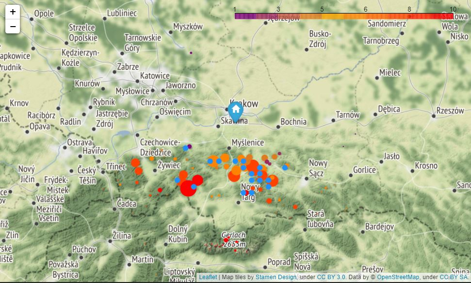

# SOTA Visualisation Pack
by www.operator-paramedy.pl

# What SOTA is?

SOTA (Summits On The Air) is an activity designed for radio amateurs (called also HAMs) who like hiking. It is about communication via ration between an activator - operator who climbed a designated summit (map available at https://sotl.as/map) - and chasers - all other operators. Call  (or QSO) may be done with the use of telegraphy (morse code), voice or data transmission on any band available for radio amateurs. To make a successfull call, both operators need to exchange reports, which say how they hear each other, and log it into a log. SOTA results are then uploaded into https://www.sotadata.org.uk/en/ webpage.

You can find all information about SOTA programme at https://www.sota.org.uk/.

# Pack contents

This pack is developed to visualise data relevant for SOTA chasers:

- summits that are currently activated with SOTA Spots Map,
- chaser's history records with SOTA Chasers Visualiser.

## Analysis logic

Both scripts are available as ```.py``` files for quick deployment.

If you want to see how the pack works step by step (with additional comments) you can open ```.ipynb``` files, for example in Jupyter Notebook or Google Colab. 


## SOTA Spots Map

This functionality is provided in three files:
- ```spots_visualiser.py``` - simple script generating map based on Folium map,
- ```spots_map.ipnynb``` - analysis described step-by-step,
- ```spots_visualiser_dashboard.py``` - interactive map based on Leaflet map.

Script presents "live" tracker of SOTA activations according to spots send via SOTAWatch site (https://sotawatch.sota.org.uk/). Activations spotted in the given timeline are analysed and compares with SOTA Database (see above), then marked on a map. Each summit-activator pair is presented as a circle and visualisation provides following information:
- summit's name, code, location and points value,
- activation's band, mode and frequency,
- activator's callsign,
- time since spot.

You can run the script and see latest activations or visit live dashboard, based on the same analytics algorithm,  I deployed at https://www.operator-paramedyk.pl/sota/.

## SOTA Chasers Visualiser

This functionality is provided in two files:
- ```chaser_visualiser.py``` - simple script generating map based on Folium map.
- ```chaser_visualiser.ipnyb``` - analysis described step-by-step.

This script is designed to visualise all summits chased by an operator. Input data comes from ADIF file (Amateur Data Interchange Format, see specification at https://www.adif.org/303/adif303.htm), which is one of the standards for HAM log export. Script analyses the logfile, gets coordinates of summits chased via SOTA API and plot results on a map. Information provided are:
- chaser's location - both home as well as mobile/portable, if included in the logfile,
- summit's name, code, location and points value,
- count of summit's chases.

To visualise your chases, you just need to modify ```filename``` variable name to a location where your ADIF log is saved. Alternatively, you can copy your log to a folder where ```main.py``` file is saved and rename it to ```SOTAlog.adi```.

If you are not a radioamateur, but wanted to see this script in action, I attached to the repository file ```SOTAlog.adi``` containing sample of 48 QSOs from my station's log file.

At the day when I published first version of this script, my station's log counted 1060 QSOs and among them there were 353 SOTA chases. Below you can see visualisation of all of them with the use of this script.



# APIs and dependencies used

Pack is scripted in Python. Beside the packages required, specified in ```requirements.txt``` file, there are two external dependencies used by scripts:  

- SOTA API, available at at https://api2.sota.org.uk/docs/index.html,
- SOTA summits database, available at https://www.sotadata.org.uk/summitslist.csv (saved also locally in respository).
