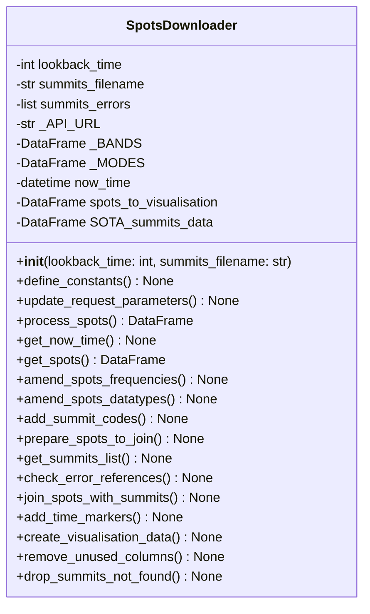
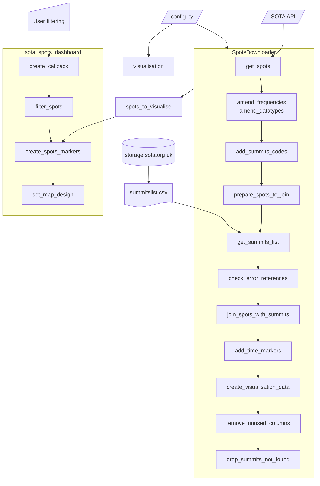

# SOTA Visualisation Pack
by [operatorIT.pl](operatorIT.pl) / SQ9NIL


# What SOTA is?

SOTA (Summits On The Air) is an activity designed for radio amateurs (called also HAMs) who like hiking. It is about communication via radio between an activator - operator who climbed a designated summit (map available at https://sotl.as/map) - and chasers - all other operators. Call (or QSO) may be done with the use of telegraphy (morse code), voice or data transmission on any band available for radio amateurs. To make a successfull call, both operators need to exchange reports, which say how they hear each other, and log it into a log. SOTA results are then uploaded into https://www.sotadata.org.uk/en/ webpage.

You can find all information about SOTA programme at https://www.sota.org.uk/.

This project provides a live map of SOTA activations currently ongoing (understand by default as "spotted less than 1 hour ago") as a Dash Leaflet map. As a legacy module, also script to visualise chases from imported log is available in ./log_visualisation folder, but it is not further developed (so far).

# How to use this pack?

You can use this repository for any personal and non-commercial use. I'll be happy to hear from you if you integrate it with some system/solution.

To prepare an environemnt, after downloading the repository you need to:
1. [Create and activate a virtual environment](https://docs.python.org/3/library/venv.html). 
2. Download [list of SOTA summits](https://storage.sota.org.uk/summitslist.csv) into the project's folder.
3. Install project's requirements/dependencies:
```bash
pip install -r requirements.txt
```

If you want to __visualise current SOTA spots__, after set up please:
4. If required, modify `config.py` file or variables in the script.
5. Run the dashboard:
```bash
python spots_visualiser.py
```
6. In terminal you'll see the link to the dashboard ((127.0.0.1:8080)[127.0.0.1:8080] with default setup) - you can open it in your browser.

If you want to __visualise your log__, after set-up you have to:
4. Upload your log to `./log_visualisation/` folder.
5. In `./log_visualiser/chasers_visualiser.py` script change variable `filename` (line 10) to your log filename.
6. Run the script:
```bash
python ./log_visualiser/chasers_visualiser.py`
```

# Project structure

.
├── docs # graphics for this documentaiton
├── log_visualistion # legacy module for chasers visualisation based on log
    ├── chaser_visualiser.ipynb
    ├── chaser_visualiser.py
    └── SOTAlog.adi # example log
├── tests
    ├── conftest.py # mocks for tests
    ├── test_spotsdownloader_init.py
    └── test_SpotsDownloader.py
├── __init__.py
├── .gitignore
├── config.py # script configuration
├── pyproject.toml
├── pytest.ini
├── README.md -> **you are here**
├── requirements.txt
├── spots_map.ipynb
├── spots_visualiser.py
├── SpotsDownloader.py
└── summitslist.csv # list of SOTA summits - please update before running

# Pack contents

This pack is developed to visualise data relevant for SOTA chasers.

The main functionality is to provide live map of SOTA activators - __SOTA Spots Map__(`spots_visualiser.py`) with interface (`SpotsDownloader.py`) downloading activation data from sota.org.uk API and preparing it for visualisation. SOTA Spots Map is based on `dash_leaflet` package for visualisation using OpenStreetMaps.
Tests for SOTA Spots Map are available in `./test/` folder.
Notebook `spots_map.ipynb` presents the logic of visualisation, however it is a part of development code and does not reflect actual use of SOTADownloader class.

There is legacy code __SOTA Chasers Visualiser__ in `./log_visualisation/` for visualistaion of chased summits based on chaser's log. As I focused on SOTA Spots Map, __it has been not updated since it was my excercise to learn Python__, so it's not beautiful, but works.

## SOTA Spots Map

It's my main purpose to build this package.

This functionality consist of three components:
- `SpotsDownloader.py` - a class handling spots download and pre-processing,

```mermaid
classDiagram
    class SpotsDownloader {
        -int lookback_time
        -str summits_filename
        -list summits_errors
        -str _API_URL
        -DataFrame _BANDS
        -DataFrame _MODES
        -datetime now_time
        -DataFrame spots_to_visualisation
        -DataFrame SOTA_summits_data
        
        +__init__(lookback_time: int, summits_filename: str)
        +define_constants() None
        +update_request_parameters() None
        
        +process_spots() DataFrame
        
        +get_now_time() None
        +get_spots() DataFrame
        
        +amend_spots_frequencies() None
        +amend_spots_datatypes() None
        +add_summit_codes() None
        +prepare_spots_to_join() None
        
        +get_summits_list() None
        +check_error_references() None
        +join_spots_with_summits() None
        
        +add_time_markers() None
        +create_visualisation_data() None
        +remove_unused_columns() None
        +drop_summits_not_found() None
    }
    
```
- tests for SpotsDownloader class in `./tests/` subfolder, including unit tests and integration ones,
- `spots_visualiser.py` - script generating interactive spots map based on Leaflet-dash map with callback filtering options.

Script presents "live" tracker of SOTA activations according to spots send via SOTAWatch site (https://sotawatch.sota.org.uk/). Activations spotted in the given timeframe (1 hour by default) are analysed and compares with SOTA Database (see above), then marked on a map. Each summit-activator pair is presented as a circle and visualisation provides following information:
- summit's name, code, location and points value,
- activation's band, mode and frequency,
- activator's callsign,
- time since spot.

Processing logic:

```mermaid
graph TB
    subgraph SpotsDownloader
        B[get_spots] --> C[amend_frequencies <br> amend_datatypes] --> D[add_summits_codes]
        D --> E[prepare_spots_to_join] --> F[get_summits_list]
        F --> G[check_error_references] --> H[join_spots_with_summits]
        H --> I[add_time_markers] --> J[create_visualisation_data] 
        J --> K[remove_unused_columns] --> L[drop_summits_not_found]
        
    end
    conf@{shape: lean-r, label: "config.py"} --> SpotsDownloader
    conf --> visualisation
    sota_api@{shape: lean-r, label: "SOTA API"} --> B
    summits_db[(storage.sota.org.uk)] --> summits_file@{shape: doc, label: "summitslist.csv"} --> F
    SpotsDownloader --> spots_to_visualise
    spots_to_visualise --> spots
    subgraph sota_spots_dashboard
        spots[create_spots_markers] --> map[set_map_design]
        callback[create_callback] --> filtering[filter_spots] --> spots
    end

    user@{shape: manual-input, label: "User filtering"} --> callback
```

Tests are written in `pytest`. To execute them, just run `pytests` in the main folder.

You can run the script and see latest activations or visit live dashboard, based on the same analytics algorithm deployed at https://www.operatorit.pl/sota/.

## SOTA Chasers Visualiser

This functionality is provided in two files:
- ```chaser_visualiser.py``` - simple script generating map based on Folium map.
- ```chaser_visualiser.ipnyb``` - analysis described step-by-step.

This script is designed to visualise all summits chased by an operator. Input data comes from ADIF file (Amateur Data Interchange Format, see specification at https://www.adif.org/303/adif303.htm), which is one of the standards for HAM log export. Script analyses the logfile, gets coordinates of summits chased via SOTA API and plot results on a map. Information provided are:
- chaser's location - both home as well as mobile/portable, if included in the logfile,
- summit's name, code, location and points value,
- count of summit's chases.

To visualise your chases, you just need to modify ```filename``` variable name to a location where your ADIF log is saved. Alternatively, you can copy your log to a folder where ```main.py``` file is saved and rename it to ```SOTAlog.adi```.

If you are not a radioamateur, but wanted to see this script in action, I attached to the repository file ```SOTAlog.adi``` containing sample of 48 QSOs from my station's log file.

At the day when I published first version of this script, my station's log counted 1060 QSOs and among them there were 353 SOTA chases. Below you can see visualisation of all of them with the use of this script.

# APIs and dependencies used

Pack is scripted in Python. Beside the packages required, specified in ```requirements.txt``` file, there are two external dependencies used by scripts:  

- SOTA API, available at at https://api2.sota.org.uk/docs/index.html,
- SOTA summits database, available at https://www.sotadata.org.uk/summitslist.csv (saved also locally in respository).

# Contributions

Feel free to contribute to my project by raising issues or pulling your contributions/ideas.

# Further development

Sample ideas of project development (you can add your own ones!):
- include another HAM radio programme: [Parks On The Air](https://parksontheair.com/index.html);
- refactor log_visualisation;